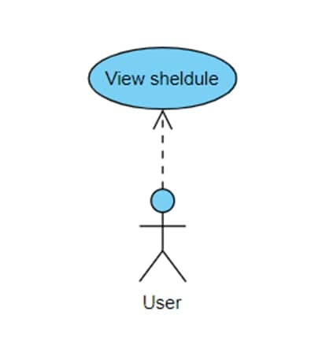
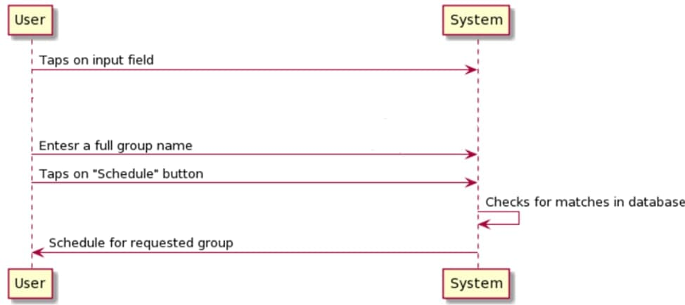

# Зміст
1. [Вступ](#вступ)
2. [Технічне завдання](#технічнезавдання)
3. [Основні положення](#основніположення)
4. [Проектування](#проектування)
5. [Висновки](#висновки)
6. [Джерела](#джерела)
___

# Вступ
__Проект "Rozklad KPI for Remake"__ — це проект, який відтворює функціонал офіційного розкладу КПІ із зручнішим інтерфейсом.  

__Мета:__ Метою документа є з'ясування основних вимог до функціональності та експлуатаційної придатності, а також визначення бізнес-правил і можливих технологічних обмежень предмета розробки.  

__Реалізація:__ Для реалізації проекту використовувалось середовище розробки Android Studio  

___

# Технічне завдання
__Загальне завдання__ Розробити додаток на android, що надає можливість переглядати список занять для студентів та викладачів.  

__Функціональність__
* користувач повинен мати можливість переглянути розкдлад для студентів
* користувач повинен мати можливість переглянути розкдлад для викладача
* користувач повинен мати можливість переглянути розкдлад сесії
___

# Основні положення
### Поняття розкладу
__Розклад занять__ — це ієрархічно впорядкований за часом список лекцій, лабораторних та практичних занять, які студент відвідує протягом навчального періоду. 
__Значення під час навчального процесу__ — розклад зазвичай включає час та місце проведення занять, що студент буде вивчати протягом конкретного тижня.
### Технології використані в розробці
__Android Studio__ — інтегроване середовище розробки (IDE) для платформи Android, адаптоване для виконання типових завдань, що вирішуються в процесі розробки застосунків для платформи Android.  

__Volley__ - це HTTP-бібліотека, яка спрощує і прискорює роботу в мережі для додатків Android.
Volley пропонує наступні переваги:
* Автоматичне планування мережевих запитів.
* Кілька одночасних мережевих з'єднань.
* Прозоре кешування відповідей диска та пам'яті зі стандартною когерентністю кешу HTTP.
* Підтримка пріоритетності запитів.
* API запиту на скасування. Ви можете скасувати один запит, або ви можете встановити блоки або обсяги запитів для скасування.
* Простота налаштування, наприклад, для повторної спроби та відмови.
* Потужне впорядкування, що спрощує правильне заповнення вашого інтерфейсу даними, що отримуються асинхронно з мережі.
* Інструменти налагодження та трасування.
___

# Проектування
## Діаграма юзкейсів

## Діаграма бази даних
__Діаграма STUDENTS-TIMETABLE__

## Сценарій перегляду розкладу занять для студентів
Ідентифікатор:	| STUDENTS-TIMETABLE
:---------------|:-------------------:
Назва:	| Перегляд розкладу занять для студентів
Учасники:	| Система, Користувач
Передумови:	| Користувач захотів переглянути розклад занять конкретної групи
Результат:	| Користувач отримав впорядкований за часом список занять вказаної групи
Виключні ситуації:	| В системі немає вказаної групи  /В системі немає розкладу для потрібної групи
Основний сценарій:	| 1.Користувач натискає на поле вводу групи 2. Користувач вводить назву груп 3. Користувач натискає кнопку «Розклад» 4. Система перевіряє чи є шукана група у базі даних. 5. Користувач отримує список занять для введеної групи

# Проектування інтерфейсу
## Опис структури проекту

### Сторінка пошуку розкладу занять груп
### Сторінка пошуку розкладу викладачів
### Сторінка пошуку розкладу сесій
### Сторінка розкладу занять групи
___

# Висновки
Було розроблено android-додаток для зручного перегляду розкладу занять. Android Studio – чудовий інструмент для розробки додатків не тільки для смартфонів і планшетів, але і для носимих пристроїв на базі Wear OS, телевізорів (Android TV), окулярів Google Glass і автомобільних інформаційно-розважальних систем (Android Auto).  

Valley забезпечує швидку роботу з API, тим самим зменшивши час очікування на стороні клієнта.
___

# Джерела
1.	https://www.fandroid.info/razrabotka-v-android-studio-prilozhenij-dlya-android-s-nulya-na-yazyke-java-videouroki/
2.	https://www.youtube.com/watch?v=Sp04fLzeuqo&list=PLmjT2NFTgg1c-CC0l6GuvpH7_2JZBxqzf
3.	https://www.youtube.com/watch?v=63WP8uTajO4&list=PLiyjLbEJ4htZC3N-OrOdLQyZd4usgFtX0&index=1
4.	https://uk.wikipedia.org/wiki/Android_Studio
5.	https://dev.by/news/chto-takoe-api-prostym-yazykom
6.	https://api.rozklad.org.ua/
7.	https://habr.com/ru/post/495976/

